<style>
img[alt~="center"] {
  display: block;
  margin: 0 auto;
}
</style>

# SchoolRISCV

https://github.com/zhelnio/schoolRISCV

Stanislav Zhelnio, 2020

<!-- Добрый день! Данная ликция является введением в микроархитектуру процессорных систем. И эту тему мы рассмотрим на примере проекта schoolRISCV. Адрес, по которому доступны исходные коды проекта, а также материалы лекции приведен на первом слайде -->

---

<!-- paginate: true -->

## Благодарности

- David Harris & Sarah Harris
- Юрий Панчул
- Александр Романов
- IVA Technologies

<!-- Что такое schoolRISCV это самое простое процессорное ядро, которое только можно придумать и оно бы не появилось на свет без легендарного учебника Дэвида Харрис и Сары Харрис "Цифровая схемотехника и архитектура компьютера. Раньше проект назывался schoolMIPS и идея создать его принадлежит Юрию Панчулу. Очень активное участие в разработке микроархитектуры первой версии ядра принял Александр Романов. А его студенты портировали и запустили его на множестве отладочных плат. Также будет правильным упомянуть компанию IVA Technologies, работником которой я являюсь, за возможность работать над этим open source проектом в рабочее время. Так, в частности, подготовлена данная презентация -->

---

## Что такое schoolRISCV

- простое процессорное ядро для практического преподавания школьникам основ цифровой схемотехники
- написано на языке Verilog
- реализует подмножество архитектуры RISCV
- вырос из аналогичного проекта schoolMIPS

<!-- Итак, что такое schoolRISCV - это самое простое процессорное ядро, которое можно только придумать. И оно создавалось изначально для того, чтобы можно было объяснить школьникам, людям без профильного образования, как работает процессор. При этом оно не является "игрушечным": - написано на "взрослом" языке описания аппаратуры Verilog; реализует подмножество архитектуры RISCV - т.е. на нем может быть запущена программа, скомпилированная "взрослым" компилятором. Пусть и с некоторыми нюансами навроде того, что поддерживаются не все инструкции RISCV, а только их часть - подмножество -->

---

## Микроархитектура

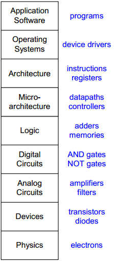

- аппаратная реализация архитектуры в виде схемы

- возможны разные реализации одной архитектуры:
    - однотактная
    - многотактная
    - конвейерная

<!-- Что такое микроархитектура? Микроархитектура это аппаратная реализация архитектуры в виде некой цифровой схемы. В чем принципиальная разница между микроархитектурой и архитектурой вычислительной системы? Для программистов архитектура выглядит как набор инструкций и регистров, которые доступны внутри проецссора. На архитектуру вычислительной системы можно смотреть как на договор или соглашение между разработчиками процессоров и программистами, которому следуют обе стороны. Следование этому договору позволяет писать программы, которые могут выполняться на процессорах, имеющих разную реализацию - разную микроархитектуру.
Т.е. процессоры могут быть спроектированны совершенно по разному и разными командами. Например, этом один процессор может быть разработан с упором на энергопотребление, а другой с целью получить максимальную производительность. Но если при этом они соответствуют требованиям архитектуры, то запущенная на них одна и та же программа будет выдавать один и тот же результат.
В самом простейшем виде мы можем реализовать одну и ту же архитектуру в виде процессора с однотактной, многотактно или конвейерной микроархитектурой. В первом случае каждая инструкция выполняется ровно один такт. Во втором - несколько тактов. И в последнем - процессор одновременно выполняет несколько инструкций, каждая из которых находится на своей стадии выполнения.
Все современные процессоры - конвейерные.
При этом однотактный процессор очень хорошо рассматривать для обучения. -->

---

## Особенности schoolRISCV

- однотактная реализация
- нет памяти данных
- словная адресация памяти команд
- 9 инструкций: **add**, **or**, **srl**, **sltu**, **sub**, **addi**, **lui**, **beq**, **bne**

...и этого уже достаточно, чтобы посчитать квадратный корень!

<!-- В чем особенности schoolRISCV - это однотактная реализация архитектуры RISC-V, максимально похожая на однотактный процессор архитектуры MIPS, описанный на страницах книги Цифровая схемотехники и архитектура компьютера. При этом он еще больше упрощен по сравнению с описанным в книге: в частности у него нет памяти данных. Словная адрессация памяти команд - что это такое мы поговорим в дальнейшем. И всего 9 инструкций. При этом этих 9 инструкций достаточно, чтобы посчитать, например, квадратный корень. Т.е. не смотря на то, что этот процессор можно спроектировать за 1 час и реализовать еще за 1 час с ноля, на нем программно можно выполнять вычисления, которые далеко не каждый человек может выполнить на листке бумаги. -->

---

## Последовательность проектирования

- тракт данных
  Data Path

- устройство управления
  Control Unit

<!-- Как мы будем его проектировать? Мы начнем с тракта данных - это тем цепи и устройства, через которые непосредственно ходят обрабатываемые нами данные. После чего спроектируем устройство управления - блок, который обеспечивает управление коммутацией между устройствами тракта данных, и устанавливает режимы работы этих устройств в зависимости от того, какая инструкция сейчас выполняется. -->

---

## Спецификация RISC-V

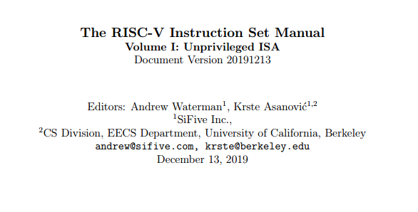

https://riscv.org/specifications/

<!-- Чем мы при этом будем руководствоваться? Мы будем руководствоваться спецификацией архитектуры RISC-V, которую можно загрузить по адресу, приведенному на слайде. Эта спецификация как раз является договором между разработчиками аппаратных средств и программных средств.
Что мы можем про нее сказать? Во-первых это живой документ, в который периодически вносятся изменения. Мы, в частности, рассматриваем версию от декабря 2019 года. И нас интересует только первый том спецификации, в котором описаны непривилегированные инструкции. Те инструкции, которые доступны программисту, когда он пишет обычную прикладную программу. И мы не рассматриваем привилигерованные инструкции - те, с помощью которых можно управлять режимами работы процессора, что необходимо, например при разработке ядра операционной системы. Это мы оставим за кадром. Если кому-то из вас интересно, что это за инструкции, то в будущем вы можете скачать соответствующую спецификацию и ознакомиться с ними. -->

---

## Наборы команд RISC-V: спецификация

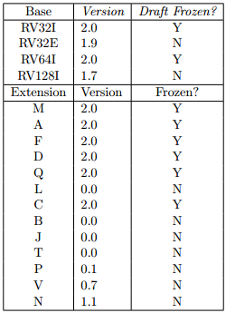

<!-- Еще из интересного про RISC-V. Спецификация разделена на разделы, описывающие наборы команд. Есть 4 базовых набора команд, один из которых обязательно должен быть реализован в RISC-V процессоре. И есть наборы расширений, реализация которых не является обязательной, но при этом повышает возможности процессора. К примеру, набор M - это инструкции аппаратного умножения и деления. А набор F - это инструкции для работы с числами с плавающей точкой.
Мы будем рассматривать команды из базового набора RV32I - это набор инструкций для работы с 32-битными целыми числами. Вот часть из этих инструкций мы реализуем в своем процессоре -->

---

## Архитектурное состояние: спецификация

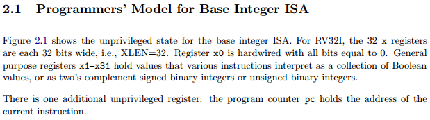

<!-- Начнем мы с того, что посмотрим на процессор, как на конечный автомат. Конечный автомат - это система, следующее состояние которой зависит от текущего состояния и от того, какие сигналы находятся у нее на входах. При этом выходные сигналы зависят либо только от текущего состояния, либо еще и от входных сигналов. Вот это сотояние конечного автомата применительно к процессору называется Архитектурным состоянием. И, в частности, в спецификации оно описано следующим образом. Что оно включает в себя 32 регистра общего назначения, широной 32 бита каждый. При этом самый первый (нулевой) регистр при чтении всегда возвращает ноль.
И также есть регистр под названием program counter, который содержит адрес текущей выполняемой инструкции -->

---

## Архитектурное состояние


<!-- Изобразим элементы архитектурного состояния на схеме. Первым идет program counter. Это обычный 32-битный регистр. У него есть вход, на который подается его следующее значение, и выход, с которого можно считать текущее. Следующие значение превращается в текущее по фронту тактового сигнала.
Теперь рассмотрим блок регистров общего назначения. У него есть 3 порта. Два порта чтения, и один порт записи. Первый порт чтения - это вход A1 и выход RD1. На вход мы подаем номер регистра, данные которого хотим считать. На выходе мы получаем данные этого регистра. Чтение при этом асинхронное - данные доступны в том же такте. Работа второго порта чтения, который A2 - RD2 абсолютно аналогично. С портом записи все немного сложнее: на вход A3 подается номер регистра, в который необходимо сохранить данные, на WD3 - сами записываемые данные. А на вход WE3 - сигнал разрешения записи. И в этом случае данные будут записаны по фронту тактового сигнала. После чего станут доступны для чтения начиная со следующего такта.
Чуть позже мы рассмотрим реализацию каждого из этих блоков на Verilog.
Также у нас есть память команд, в которой хранится наша программа. У нее есть вход адреса текуй инструкции, и выход данных. Чтение также асинхронное - данные доступны в этом же такте.
Также есть память данных, которая условно показана серым цветом, т.к. в schoolRISCV она отсуствует, т.е. мы считаем, что ее у нас нет.
Забегая вперед, после завершения этой лекции для вас не составит труда добавить ее в процессор самостоятельно, либо подсмотрев, как это делается для MIPS процессора на страницах Цифвровой схемотехники и архитектуры компьютера. -->

---

## ADDI: выборка инструкции


<!-- Мы будем проектировать процессор следующим образом: начнем с выборки инструкции из памяти, и постепенно будем наращивать тракт данных блоками, которые необходимы, чтобы эту инструкцию в процессоре реализовать. Итак, PC содержит адрес инструкции. И у нас есть память команд, которая содержит программу, состоящую из 32-битных инструкций. Нам необходимо выбрать из памяти команд инструкцию, которая лежит по адресу. Но есть один нюанс: PC содержит адрес первого байта инструкции в памяти. А память инструкций у нас хранит 32-битные слова, каждое из которых состоит из 4 байт, или, выражаясь иначе, имеет словную адресацию. Поэтому для того, чтобы выполнить корректное чтение, нам необходимо разделить текущий адрес на 4, либо выполнить сдвиг адреса на 2 бита вправо. Что мы и делаем. Мы добавляем схему сдвига вправо, вход которой подключаем на выход PC, а выход - на вход адреса памяти команд. После этого на выходе памяти RD мы можем считать текущую выбранную инстркуцию.
И нам необходимо как-то ее интерпретировать. В соответствии с какими правилами мы будем эту инструкцию интерпретировать. -->

---

## ADDI: спецификация

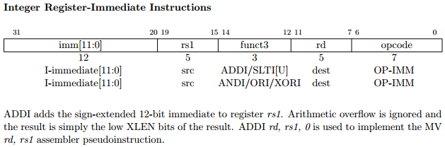
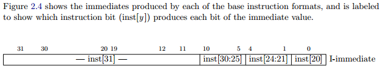

<!-- Для этого давайте посмотрим в спецификацию. Пусть текущая выбранная инструкция - это инструкция сложения числа, которое хранится в регистре общего назначения, с константой. Эта команда, которая называется ADDI - add immediate. Описание этой инструкции из спецификации привидено на экране.
Я рекомендую вам открыть спецификацию и найти описание этой инструкции в документе. Это может немного упростить вам дальнейшую работу, т.к потом, когда вы получите задание самостоятельно реализовать ту или иную инструкцию и добавить ее поддержку в schoolRISCV, вам будет проще ориентироваться в документе.
Итак, что мы можем сказать про инструкцию ADDI:
- мы можем идентифицировать эту инструкцию, т.е. отличить ее от других инструкций с помощью полей opcode и funct3 - это поля, которые имеют свое уникальное значение.
- для того, чтобы выполнить операцию ADDI нам необходимо взять число из регистра с номером rs1, прибавить к нему констранту, закодированную в поле Immediate, и сохранить результат в регистре с номером rd
- поле Immediate имеет ширину 12 бит, и тот способ, которым мы преваращем ее в 32-битное число также приведен в спецификации. Мы видим, что  младшие 11 разрядов константы (с 0 по 10) используются как есть, а вот старший бит копируюется во все биты с 11 по 31. По факту так производится расширение знака для чисел в дополнительном коде. 
Хорошо, теперь мы понимаем, что нам необходимо получить -->

---

## ADDI: считывание операнда из регистрового файла


<!-- Начнем с регистра rs1, в котором хранится один из операндов инструкции. Номер этого регистра содержится в поле с 15 по 19 биты команды. Для того, чтобы считать значение из регистра с этим номером мы соединяем эти биты инструкции с адресным входом A1 первого порта чтения регистрового файла. Так на выходе RD1 мы получили число, которое хранится регистре c номером RS1 -->

---

## ADDI: декодирование константы из тела инструкции


<!-- Продолжаем. Один операнд у нас уже есть, получим значение второго операнда операции сложения. Для этого нам необходимо декодировать поле Immediate и превратить его в 32-битную константу. Сделаем это в точном соответсвии со спецификацией: младшие 11 бит используем как есть, срашим битом заполняем все встаршие разряды 32-битного числа. И делать это будем в новом блоке, который назовем Декодером Инструкций, куда поместим всю комбинационную логику с этим связанную -->

---

## ADDI: вычисление результата арифметической операции


<!-- Итак, у нас есть два операнда: одно число мы получили из регистра, второе декодировали из тела инструкции. Теперь эти числа необходимо сложить. Делать это мы будем с помощью специального блока, который называется Арифметико-логическое устройство, или Arifmetic Logic Unit (ALU). Это комбинационная схема, внуртри которой вычисляются все арифметические и логические операции над данными. И у которой есть:
- два входа для данных (srcA и scrB);
- управляющий вход aluControl, с помощью которого мы задаем режим работы АЛУ - ту операцию, которую мы ходим выполнить над входными данными. Это может быть сложение, как в нашем текущем случае, или вычитание, сдвиг и т.д. Значение сигнала aluControl в дальнейшем будет задаваться с помощью устройства управления - блока Control Unit;
- также у АЛУ есть выходной порт result, с которого можно считать результат вычислений 
На один вход мы подаем данные, которые мы извлекли из регистра. На второй порт мы подаем константу, которую мы сформировали из соответствующего поля обрабатываемой инструкции. Устройство управления, это мы рассмотрим позже, на основе полей opcode и func3 формируем соответствующий сигнал aluControl. И в результате на выходе АЛУ мы получаем результат сложения данных, извлеченных из регистра rs1 и константы.
-->

---

## ADDI: декодирование регистра назначения


<!-- Мы получили результат сложения операндов и теперь нам необходимо его сохранить в регистровый файл. Номер регистра, в который нам необходимо выполнит сохранение, задается в поле инструкции RD. Уже привычным нам способом подключаем биты инструкции с 7 по 11 к адресному входу порта записи A3 регистрового файла. -->

---

## ADDI: запись результата в регистр назначения


<!-- Теперь нам необходимо передать записываемые данные на вход порта записи регистрового файла. Делаем это, соединяя выход АЛУ - сигнал aluResult со входом регистрового файла WD3. Помимо этого устройство управление обеспеечивает подачу сигнала regWrite на вход разрешения записи WE3. Теперь, когда все эти условия выполнены, то когда наступит фронт тактового сигнала, данные будут записаны в регистровый файл. Важный момент: все, что мы обсуждаем, начиная с момента выборки инструкции из памяти данных, происходит в течении одного и того же такта. -->

---

## ADDI: вычисление адреса следующей инструкции


<!-- Мы вычислили результат сложения числа и константы и подготовили данные к записи в регистровый файл. Для того, чтобы на следующем такте перейти к следующей инструкции, нам необходимо вычислить ее адрес. Мы помним, что одна инструкция занимает 4 байта, поэтому добавляем в схему сумматор, который прибавит к текущему значению PC число 4, и подключим его выход на вход регистра PC  -->

---

## ADDI: итоговая схема


<!-- В итоге процессор, который умеет выполнять одну единственную команду целочисленного сложения регистрового операнда и константы выглядит следующим образом. Давайте еще раз повторим тот путь, который проходят обрабатываемые данные:
- мы производим выборку инструкции по текущему адресу PC;
- декодируем инструкцию и получаем из нее номер регистра, в котором хранится первый операнд, считываем информацию из регистра с этим номером, подаем ее на вход АЛУ;
- из декодированной инструкции получаем значение константы, которые подаем на второй вход АЛУ;
- по коду инструкции определяем, какую именно операцию должен выполнить код АЛУ и устанавливаем ему соответствующий режим работы;
- вычисляем результат операции и подаем его на порт записи регистрового файла, разрешаем запись в регистровый файл;
- из декодированной инструкции получаем номер регистра, в который необходимо сохранить результат;
- вычисляем адрес следующей команды;
После всего перечисленного, как только наступит фронт тактового сигнала в регистровый файл в регистр с номером RD будет записан результат выполнения операции. А в регистр PC - адрес следующей команды 
Теперь у нас есть процессор, который умеет выполнять одну инструкцию. Давайте добавим еще несколько. При этом для каждоый из добавляемых инструкций мы будем вносить изменения в уже существующую схему.
-->

---

## ADD: спецификация

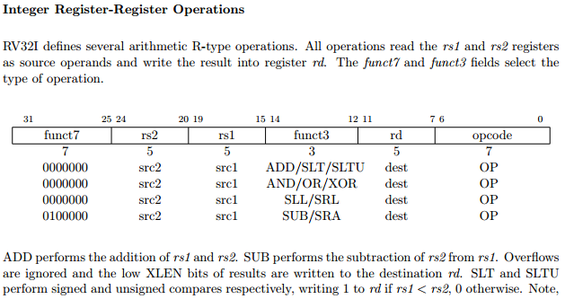

<!-- Добавим в процессор поддержку команды ADD - инструкции целочисленного сложения двух регистровых операндов. От ранее рассмотренной ADDI она отличается тем, что оба операнда хранятся в регистровом файле. Нам необходимо сложить числа из регистров rs1 и rs2 и сохранить результат операции в регистр rd. При этом от других инструкций ее отличают уникальное сочетаний значений полей opcode, funct3 и funct7 -->

---

## ADD: выборка операнда rs1


<!-- Выборка инструкции из памяти, ее декодирование и выброрка операнда RS1 и его подача на вход ALU srcA выполняеются с помощью уже существующей схемы, и какие-либо модификации в нее на данном этапе вносить нет необходимостии -->

---

## ADD: выборка операнда rs2


<!-- Выборку из регистрового файла операнда rs2 произведем аналогичным образом: подключим на вход регистрового файла A2 значение числа, которое хранится в поле rs2 - биты инструкции 20-24. После этого на выходе RD2 появится значение, которое хранится в соответствующем регистре. И здесь возникает интересная ситуация: нам необходимо подать значение с порта регистрового файла RD2 на вход АЛУ srcB, но на этот вход уже подключена константа. -->

---

## ADD: передача второго операнда в АЛУ


<!-- Ничего страшного. Добавляем в наш тракт данных мультиплексор, с помощью которого мы будем переключать вход АЛУ между источниками данных: регистровым файлом или декодированной константой. Управляться этот мультиплексор будет сигналом aluSrc, значение которого должно задаваться Устройством управления в зависимости от обрабатываемой на текущем такте команды -->

---

## ADD: итоговая схема


<!-- Итоговая схема процессора, который умеет выполнять две команды: ADDI и ADD приведена на слайде. Я прошу вас потратить некоторое время и самостоятельно проследить путь всех сигналов, с помощью которых обеспечивается вычисление инструкции ADD c момента считывания инструкции из памяти, и заканчивая моментом сохранения результата и перехода к следующей инструкции. -->

---

## LUI: спецификация

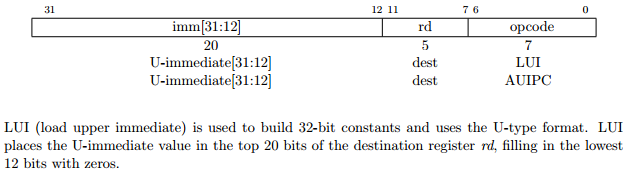
...
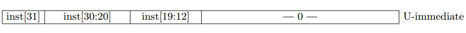

---

## LUI: декодирование и передача константы


---

## BEQ: спецификация

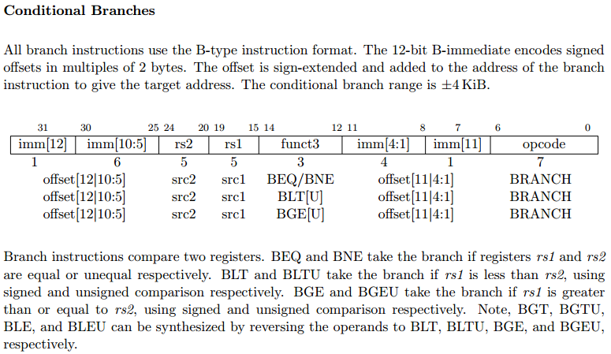

---

## BEQ: вычисление адреса условного перехода


---

## BEQ: выбор адреса


---

## BEQ: определение необходимости перехода


---

## BEQ: итоговая схема


---

## BNE: BEQ наоборот


---

## BNE: новая цепь управления


---

## Устройство управления


---

## Декодирование типа инструкции


---

## Итоговая схема процессора


---

## Состав процессора

- Тракт данных
    - Счетчик команд _PC_
    - Память инструкций _Instruction Memory_
    - Декодер инструкций _Instruction Decoder_
    - Регистровый файл _Register File_
    - Арифметико-логическое устройство _ALU_
    - Сумматоры адреса _pcPlus4_ и _pcBranch_
    - Мультиплексоры _pcSrc_, _wdSrc_ и _aluSrc_
- Устройство управления

---

## Реализация: PC, сумматоры и мультиплексор адреса

```Verilog
// sm_register.v
module sm_register (
    input                 clk,
    input                 rst,
    input      [ 31 : 0 ] d,
    output reg [ 31 : 0 ] q
);
    always @ (posedge clk or negedge rst)
        if(~rst) q <= 32'b0;
        else     q <= d;
endmodule
```

```Verilog
// sr_cpu.v
    wire [31:0] pc;
    wire [31:0] pcBranch = pc + immB;
    wire [31:0] pcPlus4  = pc + 4;
    wire [31:0] pcNext   = pcSrc ? pcBranch : pcPlus4;
    sm_register r_pc(clk ,rst_n, pcNext, pc);
```
https://github.com/zhelnio/schoolRISCV/tree/00_simple/src

---

## Реализация: память инструкций

```Verilog
// sm_rom.v
module sm_rom
#(
    parameter SIZE = 64
)
(
    input  [31:0] a,
    output [31:0] rd
);
    reg [31:0] rom [SIZE - 1:0];
    assign rd = rom [a];

    initial begin
        $readmemh ("program.hex", rom);
    end

endmodule
```

```Verilog
// sm_top.v
sm_rom reset_rom(imAddr, imData);
```

---

## Реализация: декодер инструкций (начало)

```Verilog
// sr_cpu.v
module sr_decode
(
    input      [31:0] instr,
    output     [ 6:0] cmdOp,
    output     [ 4:0] rd,
    output     [ 2:0] cmdF3,
    output     [ 4:0] rs1,
    output     [ 4:0] rs2,
    output     [ 6:0] cmdF7,
    output reg [31:0] immI,
    output reg [31:0] immB,
    output reg [31:0] immU 
);
    assign cmdOp = instr[ 6: 0];
    assign rd    = instr[11: 7];
    assign cmdF3 = instr[14:12];
    assign rs1   = instr[19:15];
    assign rs2   = instr[24:20];
    assign cmdF7 = instr[31:25];
```

---

## Реализация: декодер инструкций (продолжение)

```Verilog
    // I-immediate
    always @ (*) begin
        immI[10: 0] = instr[30:20];
        immI[31:11] = { 21 {instr[31]} };
    end

    // B-immediate
    always @ (*) begin
        immB[    0] = 1'b0;
        immB[ 4: 1] = instr[11:8];
        immB[10: 5] = instr[30:25];
        immB[31:11] = { 21 {instr[31]} };
    end

    // U-immediate
    always @ (*) begin
        immU[11: 0] = 12'b0;
        immU[31:12] = instr[31:12];
    end
endmodule
```

---

## Реализация: регистровый файл

```Verilog
// sr_cpu.v
module sm_register_file
(
    input         clk,
    input  [ 4:0] a0,
    input  [ 4:0] a1,
    input  [ 4:0] a2,
    input  [ 4:0] a3,
    output [31:0] rd0,
    output [31:0] rd1,
    output [31:0] rd2,
    input  [31:0] wd3,
    input         we3
);
    reg [31:0] rf [31:0];

    assign rd0 = (a0 != 0) ? rf [a0] : 32'b0;
    assign rd1 = (a1 != 0) ? rf [a1] : 32'b0;
    assign rd2 = (a2 != 0) ? rf [a2] : 32'b0;

    always @ (posedge clk)
        if(we3) rf [a3] <= wd3;
endmodule
```

---

## Реализация: операции ALU

```Verilog
// sr_cpu.vh

`define ALU_ADD     3'b000  // A + B

`define ALU_OR      3'b001  // A | B

`define ALU_SRL     3'b010  // A >> B

`define ALU_SLTU    3'b011  // A < B ? 1 : 0

`define ALU_SUB     3'b100  // A - B
```

---

## Реализация: ALU

```Verilog
// sr_cpu.v
module sr_alu
(
    input  [31:0] srcA,
    input  [31:0] srcB,
    input  [ 2:0] oper,
    output        zero,
    output reg [31:0] result
);
    always @ (*) begin
        case (oper)
            default   : result = srcA + srcB;
            `ALU_ADD  : result = srcA + srcB;
            `ALU_OR   : result = srcA | srcB;
            `ALU_SRL  : result = srcA >> srcB [4:0];
            `ALU_SLTU : result = (srcA < srcB) ? 1 : 0;
            `ALU_SUB : result = srcA - srcB;
        endcase
    end

    assign zero   = (result == 0);
endmodule
```

---

## Реализация: мультиплексоры данных

```Verilog
// sr_cpu.v
wire [31:0] srcB = aluSrc ? immI : rd2;
```

```Verilog
// sr_cpu.v
assign wd3 = wdSrc ? immU : aluResult;
```

---

## Сигналы управления 1


---

## Код операции: спецификация

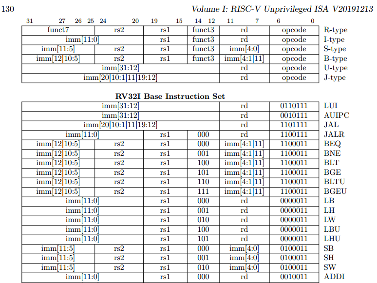

---

## Сигналы управления 2


---

## Сигналы управления 3


---

## Сигналы управления 4


---

## Сигналы управления 5


---

## Сигналы управления 6


---

## Сигналы управления 7


---

## Сигналы управления 8


---

## Сигналы управления 9


---

## Сигналы управления 10


---

## Сигналы управления 11


---

## Сигналы управления 12


---

## Сигналы управления 13


---

## Сигналы управления 14


---

## Сигналы управления 15


---

## Сигналы управления 16


---

## Сигналы управления 17


---

## Сигналы управления 18


---

## Сигналы управления 19


---

## Сигналы управления 20


---

## Сигналы управления 21


---

## Сигналы управления 22


---

## Сигналы управления 23


---

## Сигналы управления 24


---

## Сигналы управления 25


---

## Сигналы управления 26


---

## Реализация: коды инструкций

```Verilog
// sr_cpu.vh
// instruction opcode
`define RVOP_ADDI   7'b0010011
`define RVOP_BEQ    7'b1100011
...

// instruction funct3
`define RVF3_ADDI   3'b000
`define RVF3_BEQ    3'b000
`define RVF3_BNE    3'b001
`define RVF3_ADD    3'b000
...
`define RVF3_ANY    3'b???

// instruction funct7
`define RVF7_ADD    7'b0000000
...
`define RVF7_ANY    7'b??????? 
```

---

## Реализация: устройство управления (начало)

```Verilog
// sr_cpu.v
module sr_control
(
    input     [ 6:0] cmdOp,
    input     [ 2:0] cmdF3,
    input     [ 6:0] cmdF7,
    input            aluZero,
    output           pcSrc, 
    output reg       regWrite, 
    output reg       aluSrc,
    output reg       wdSrc,
    output reg [2:0] aluControl
);
    reg          branch;
    reg          condZero;
    assign pcSrc = branch & (aluZero == condZero);
```

---

## Реализация: устройство управления (продолжение)

```Verilog
// sr_cpu.v
    always @ (*) begin
        branch      = 1'b0;
        condZero    = 1'b0;
        regWrite    = 1'b0;
        aluSrc      = 1'b0;
        wdSrc       = 1'b0;
        aluControl  = `ALU_ADD;

        casez( {cmdF7, cmdF3, cmdOp} )
            { `RVF7_ADD,  `RVF3_ADD,  `RVOP_ADD  } : begin regWrite = 1'b1; aluControl = `ALU_ADD;  end
            { `RVF7_OR,   `RVF3_OR,   `RVOP_OR   } : begin regWrite = 1'b1; aluControl = `ALU_OR;   end
            { `RVF7_SRL,  `RVF3_SRL,  `RVOP_SRL  } : begin regWrite = 1'b1; aluControl = `ALU_SRL;  end
            { `RVF7_SLTU, `RVF3_SLTU, `RVOP_SLTU } : begin regWrite = 1'b1; aluControl = `ALU_SLTU; end
            { `RVF7_SUB,  `RVF3_SUB,  `RVOP_SUB  } : begin regWrite = 1'b1; aluControl = `ALU_SUB;  end

            { `RVF7_ANY,  `RVF3_ADDI, `RVOP_ADDI } : begin regWrite = 1'b1; aluSrc = 1'b1; aluControl = `ALU_ADD; end
            { `RVF7_ANY,  `RVF3_ANY,  `RVOP_LUI  } : begin regWrite = 1'b1; wdSrc  = 1'b1; end

            { `RVF7_ANY,  `RVF3_BEQ,  `RVOP_BEQ  } : begin branch = 1'b1; condZero = 1'b1; aluControl = `ALU_SUB; end
            { `RVF7_ANY,  `RVF3_BNE,  `RVOP_BNE  } : begin branch = 1'b1; aluControl = `ALU_SUB; end
        endcase
    end
```

---

## Структура проекта и подключение периферии

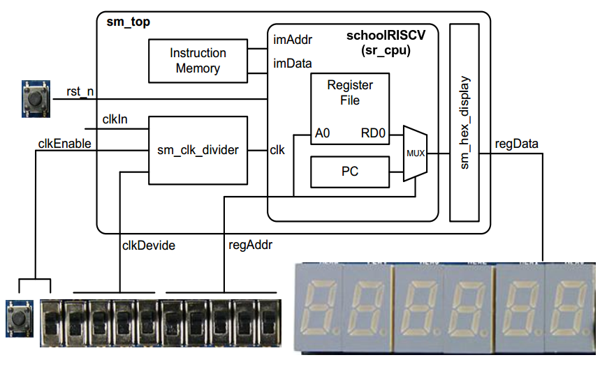

---

## Программирование системы


---

## Что дальше?

- Цифровая схемотехника и архитектура компьютера
David Harris & Sarah Harris
ДМК Пресс

- Цифровой синтез: практический курс
Александр Романов & Юрий Панчул
ДМК Пресс

- Syntacore SCR1
https://github.com/syntacore/scr1

---

## Ваши вопросы?
