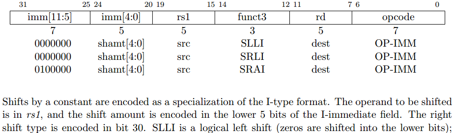
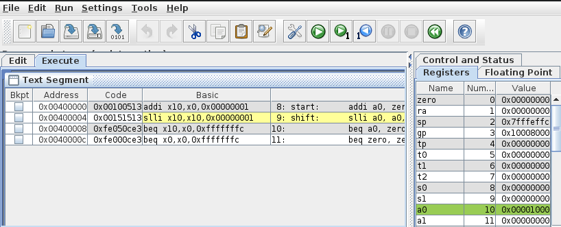
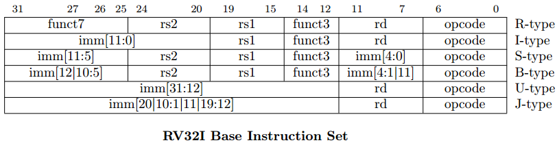
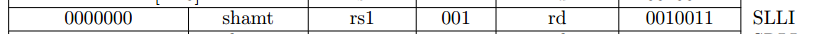
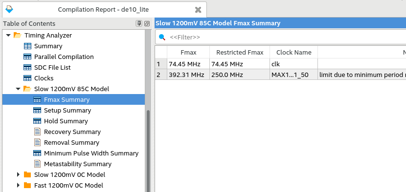

<style>
img[alt~="center"] {
  display: block;
  margin: 0 auto;
}
</style>

# SchoolRISCV. Добавление инструкции

https://github.com/zhelnio/schoolRISCV

Stanislav Zhelnio, 2020

---

## Общий порядок

- анализ спецификации
- тестовая программа
- модификация тракта данных
- модификация АЛУ
- модификация устройства управления
- проверка в симуляторе
- оценка максимальной частоты
- проверка на отладочной плате

---

## SLLI: анализ спецификации



---

## SLLI: тестовая программа

```bash
cp -r program/00_counter program/03_slli
make rars
```

```Assembly
# program/03_slli/main.S
#
# RISC-V new instruction (slli) software test
#
            .text

start:      addi a0, zero, 1         # a0 = 1
shift:      slli a0, a0, 1           # a0 = a0 << 1
            beq a0, zero, start      # if a0 == 0 then start
            beq zero, zero, shift    #            else shift
```

---

## SLLI: Проверка тестовой программы

```bash
cd program/03_slli
make rars
```



---

## SLLI: Mодификация тракта данных

Не требуется: коммутация тракта данных аналогична инструкции ADDI.


---

## SLLI: Mодификация АЛУ

```Verilog
// sr_cpu.vh
...
`define ALU_ADD     3'b000  // A + B
...
```

```Verilog
// sr_cpu.v
module sr_alu
    always @ (*) begin
        case (oper)
            default   : result = srcA + srcB;
            ...
            `ALU_SLLI : result = srcA << srcB [4:0];
        endcase
    end
    ...
endmodule
```

---

## SLLI: Mодификация  устройства управления 1




```Verilog
// sr_cpu.vh
`define RVOP_SLLI   7'b0010011
`define RVF3_SLLI   3'b001
`define RVF7_SLLI   7'b0000000
```

---

## SLLI: Mодификация  устройства управления 2

```Verilog
// sr_cpu.v
    always @ (*) begin
        branch      = 1'b0;
        condZero    = 1'b0;
        wdSrc       = 1'b0;
        ...
        casez( {cmdF7, cmdF3, cmdOp} )
            ...
            { `RVF7_SLLI, `RVF3_SLLI, `RVOP_SLLI } :
                begin 
                    regWrite = 1'b1; aluSrc = 1'b1; aluControl = `ALU_SLLI; 
                end
            ...
        endcase
    end
```

---

## Проверка в симуляторе

```bash
cd program/03_slli
make build
make modelsim
```

```text
    3  pc = 00000000 instr = 00100513   v0 = 1   addi  $10, $0, 0x00000001
    4  pc = 00000000 instr = 00100513   v0 = 1   addi  $10, $0, 0x00000001
    5  pc = 00000004 instr = 00151513   v0 = 1   new/unknown
    6  pc = 00000008 instr = fe050ce3   v0 = 2   beq   $10, $0, 0xfffffff8 (-8)
    7  pc = 0000000c instr = fe000ce3   v0 = 2   beq   $0, $0, 0xfffffff8 (-8)
    8  pc = 00000004 instr = 00151513   v0 = 2   new/unknown
    9  pc = 00000008 instr = fe050ce3   v0 = 4   beq   $10, $0, 0xfffffff8 (-8)
   10  pc = 0000000c instr = fe000ce3   v0 = 4   beq   $0, $0, 0xfffffff8 (-8)
   11  pc = 00000004 instr = 00151513   v0 = 4   new/unknown
   12  pc = 00000008 instr = fe050ce3   v0 = 8   beq   $10, $0, 0xfffffff8 (-8)
   13  pc = 0000000c instr = fe000ce3   v0 = 8   beq   $0, $0, 0xfffffff8 (-8)
   14  pc = 00000004 instr = 00151513   v0 = 8   new/unknown
```

---

## Синтез проекта

- копирование дампа памяти программ

    ```bash
    cd program/03_slli
    make board
    ```

- сборка проекта в Quartus

    ```bash
    cd ../../board/de10_lite
    make create
    make build
    ```

- просмотр отчета о сборке

    ```bash
    make open
    ```

---

## Анализ максимальной частоты

**Quartus** -> **Processing** -> **Compilation Report**



---

## Проверка на отладочной плате

- выполнить прошивку платы

    ```bash
    make load
    ```

- включить тактирование
- настроить делитель частоты
- выбрать регистр результата a0 для вывода на индикаторы
- убедиться в работоспособности программы и процессора

---

## Готово!
